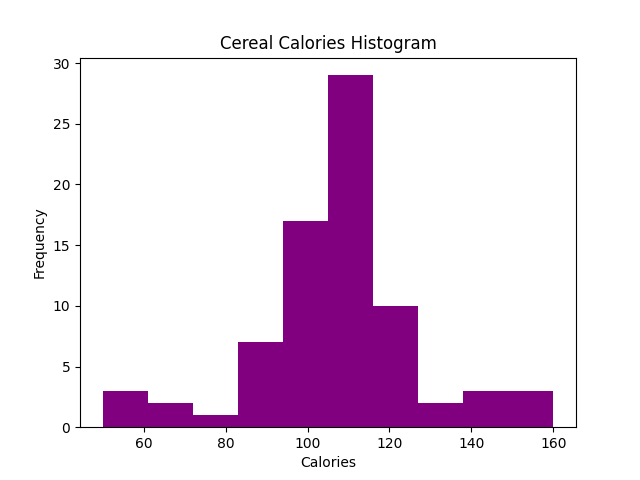

Summary:
         calories    protein        fat      sodium      fiber  ...    vitamins      shelf     weight       cups     rating
count   77.000000  77.000000  77.000000   77.000000  77.000000  ...   77.000000  77.000000  77.000000  77.000000  77.000000
mean   106.883117   2.545455   1.012987  159.675325   2.151948  ...   28.246753   2.207792   1.029610   0.821039  42.665705
std     19.484119   1.094790   1.006473   83.832295   2.383364  ...   22.342523   0.832524   0.150477   0.232716  14.047289
min     50.000000   1.000000   0.000000    0.000000   0.000000  ...    0.000000   1.000000   0.500000   0.250000  18.042851
25%    100.000000   2.000000   0.000000  130.000000   1.000000  ...   25.000000   1.000000   1.000000   0.670000  33.174094
50%    110.000000   3.000000   1.000000  180.000000   2.000000  ...   25.000000   2.000000   1.000000   0.750000  40.400208
75%    110.000000   3.000000   2.000000  210.000000   3.000000  ...   25.000000   3.000000   1.000000   1.000000  50.828392
max    160.000000   6.000000   5.000000  320.000000  14.000000  ...  100.000000   3.000000   1.500000   1.500000  93.704912

[8 rows x 13 columns]

